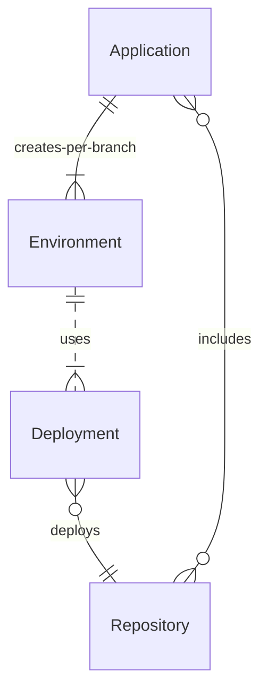
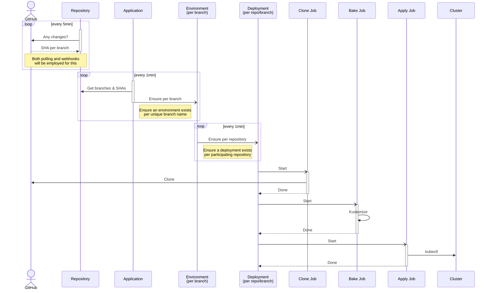

# Design

## Building blocks

### Repository

Repositories represent remote source code repositories hosting one or more application components, modules, etc. They
specify where the repository resides and how to obtain its contents.

### Application

An application represents a collection of one or more source code repositories that are composed and deployed together
and form one large user application. 

The application specifies a set of repositories (e.g. GitHub repositories) and general directives relating to how each
repository should be deployed (mainly path to deployment manifests, and a branch strategy - see below).

### Environment

For each unique branch, the Application will create its own environment, and deploy **_all_** repositories into it, from
the said branch. If one of the repositories does not have that branch, the "branch strategy" is consulted on how to
handle that (either use that repository's default branch instead, or just skip that repository for this branch).

Environments will create a `Deployment` for each `Environment`/`Repository` pair. 

### Deployment

Deployments are the means by which a repository is deployed into an environment. Therefore, one deployment exists for
each application/environment/repository combination.

For example, assuming:

- We have two repositories called `frontend` and `backend`
- We have one application (e.g. `my-application`)
- Both repositories have just one branch called `main`

The following will be created:

- One `Environment` called `main`
- Two `Deployment` objects:
  - One deploying `frontend` into the `main` environment
  - Another deployment `backend` into the `main` environment

## Change sequence

## Missing branch strategy

For each repository specified in an application, you can also specify what to do if that repository does not have the
target environment's preferred branch for deployment.

For instance, assuming that you create branch `my-backend-fix` in the `backend` repository - you would expect that:

1. `my-backend-fix` environment be created
2. the `my-backend-fix` branch from the `backend` repository would be deployed into it

_But what to do about the `frontend` repository?_ 

Well fortunately you can specify one of two behaviors:

1. Just deploy the default branch instead (e.g. `main`)
2. Skip the repository deployment altogether

The first is the default and is usually the right thing to do - e.g. in the `my-backend-fix` environment, you would
normally just expect to have the stock `frontend` implementation from the `main` branch deployed.

The second, however, is more suitable for cases where you only want to deploy a repository to an environment if indeed
it has a matching branch for it. For example, you could use this to create an environment called `poc` and only deploy
a repository into it, if it participates in that POC (proof-of-concept) and if not, exclude it.

This behavior can be defined per repository in the `Application` object.
